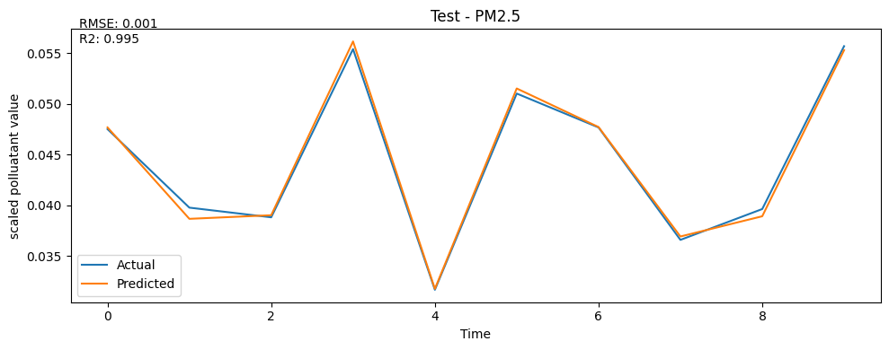
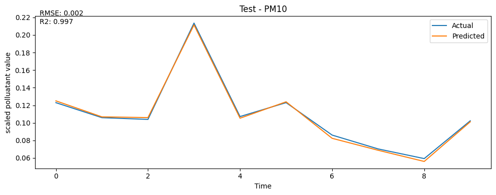
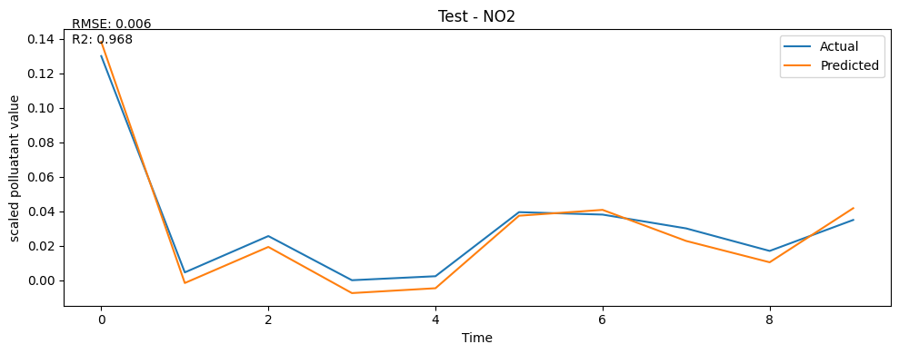
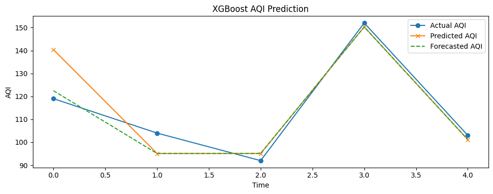

# urban-air-quality-index-predictor

This project presents a robust end to end machine learning pipeline for **multi-step Air Quality Index (AQI) forecasting** using:

- 📈 Pollutant Forecasting using Echo State Networks (ESNs) for dynamic, multi-step ahead predictions of critical pollutants (PM2.5, PM10, NO2).

- 📊 AQI Estimation via XGBoost Regressor, on forecasted pollutant levels to accurately predict future AQI values.

- ⚙️ Hyperparameter Optimization for ESNs and XGBoost to maximize predictive performance across pollutants.

- 🔁 Configurable Pipeline, allowing flexible tuning of lookback windows and forecast horizons.

- 🧪 Experiment Tracking using MLflow, ensuring reproducibility and comprehensive model evaluation.

# Pollutant Forecasting with ESN
Each selected pollutant was modeled using a *dedicated Echo State Network*, and was tuned via hyperparameter search.

 
   
   
   

## 🎯 AQI Regression via XGBoost
Using the forecasted pollutants as features , I trained an XGBoost regressor to predict the corresponding AQIs.

 
   

## 📈 Performance Metrics

### Pollutants forecasting
| Pollutant          | Best R2  | Best RMSE| 
|--------------------|----------|----------|
| PM 2.5             | 0.995    |  0.0005  |
| PM 10              | 0.997    |  0.0020  |
| NO2                | 0.968    |  0.0058  |

### Corresponding AQI prediction

| Metric  |Best value |
|---------|-----------|
| R2      | 0.951     |
| RMSE    | 4.63      |

## Recent Work

-  Integrated **Streamlit** for an interactive UI to run the AQI forecasting pipeline directly in the browser.

- Added *src/app.py* for launching the Streamlit interface.

## 🚀 Demo
Interface can be accessed here on streamlit:

